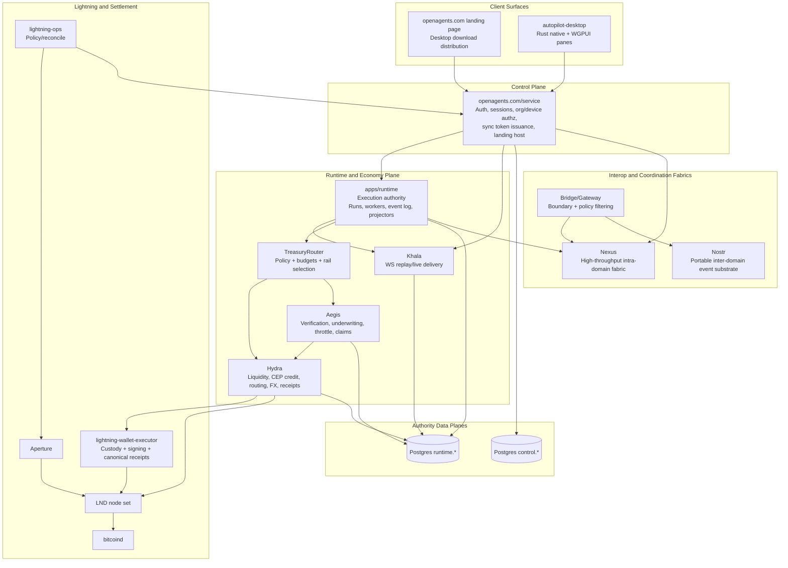

# OpenAgents Architecture

Status: Canonical Rust-era architecture
Last updated: 2026-02-25
Canonical architecture file: `docs/core/ARCHITECTURE.md`
Implementation sequencing: this document (`Implementation Sequencing` section)

## Purpose

This is the single architecture authority for OpenAgents. It defines the implemented and target-steady-state system across:

1. Client surfaces (web landing + desktop retained).
2. Control/runtime/Khala service boundaries.
3. Economy layers (Hydra liquidity + Aegis verification/underwriting).
4. Contracts, replay, and operations invariants.

If this document conflicts with implementation behavior, code wins and this document must be updated immediately.

## Authority and Invariants

This architecture is constrained by:

1. `docs/adr/ADR-0001-rust-only-architecture-baseline.md`
2. `docs/adr/ADR-0002-proto-first-contract-governance.md`
3. `docs/adr/ADR-0003-khala-ws-only-replay-transport.md`
4. `docs/adr/ADR-0004-rivet-harvest-posture-and-adoption-boundaries.md`
5. `docs/adr/ADR-0005-compatibility-negotiation-and-support-window-policy.md`
6. `docs/adr/ADR-0006-wallet-executor-auth-custody-receipts.md`
7. `docs/adr/ADR-0008-bounded-vercel-sse-compatibility-lane.md`
8. `docs/plans/rust-migration-invariant-gates.md`

Hard rules that cannot be violated:

1. Rust implementation authority for active product/runtime paths.
2. Proto-first wire contracts for cross-process and client/server boundaries.
3. Authority mutations over authenticated HTTP only.
4. Khala WebSocket-only live sync/replay transport; Khala is delivery, not authority.
5. Control-plane and runtime authority isolation (no production cross-plane SQL joins).
6. Deterministic replay/idempotency by `(topic, seq)` with stale-cursor recovery.
7. Wallet executor remains payment-signing custody boundary with canonical receipts.
8. Desktop remains the primary execution surface; web is landing-only distribution.

## Architecture Principles

1. Service boundaries are explicit and networked; no production in-memory coupling across control, runtime, and Khala.
2. Commands and writes are explicit, attributable, receipted, and idempotent.
3. Live state delivery is projection-based and replayable.
4. Economic actions (payment, credit, warranty, claim) are policy-bound and receipt-linked.
5. Observability is a product surface (`/stats`), not an afterthought.

## End-to-End Topology



## Service and Ownership Boundaries

### `apps/openagents.com/service` (control-plane authority)

Owns:

1. WorkOS-authenticated identity/session binding for OpenAgents users/devices.
2. Authorization, org membership, session revocation, and device controls.
3. Sync token issuance and scope derivation.
4. Public control APIs and hosting of a landing/download page for desktop distribution.
5. Desktop download URL authority via `OA_DESKTOP_DOWNLOAD_URL`.

Does not own:

1. Runtime execution event authority.
2. Khala ordering authority.
3. Wallet signing custody.

Retained control API surface (desktop/runtime/lightning dependent lanes):

1. Distribution and availability:
   - `GET /`
   - `GET /download-desktop`
   - `GET /healthz`
   - `GET /readyz`
   - `GET /openapi.json`
2. Auth/session identity:
   - `POST /api/auth/email`
   - `POST /api/auth/register`
   - `POST /api/auth/verify`
   - `POST /api/auth/refresh`
   - `GET /api/auth/session`
   - `GET /api/auth/sessions`
   - `POST /api/auth/sessions/revoke`
   - `POST /api/auth/logout`
   - `GET /api/me`
   - Compatibility aliases: `/api/v1/auth/*`
3. Sync and replay authorization:
   - `POST /api/sync/token`
   - `POST /api/v1/sync/token`
   - `POST /api/khala/token`
4. Runtime operator lanes used by retained clients:
   - `GET /api/runtime/threads`
   - `GET|POST /api/runtime/threads/:thread_id/messages`
   - `GET|POST /api/runtime/codex/workers`
   - `GET /api/runtime/codex/workers/:worker_id`
   - `GET /api/runtime/codex/workers/:worker_id/stream`
   - `POST /api/runtime/codex/workers/:worker_id/events`
   - `POST /api/runtime/codex/workers/:worker_id/requests`
   - `POST /api/runtime/codex/workers/:worker_id/stop`
   - `GET|POST /api/runtime/workers`
   - `GET /api/runtime/workers/:worker_id`
   - `POST /api/runtime/workers/:worker_id/heartbeat`
   - `POST /api/runtime/workers/:worker_id/status`
5. Internal service integration lanes:
   - `POST /api/internal/lightning-ops/control-plane/query`
   - `POST /api/internal/lightning-ops/control-plane/mutation`
   - `POST /api/internal/runtime/integrations/secrets/fetch` (or configured override path)
6. Control policy/status lanes retained for operations:
   - `GET /api/v1/control/status`
   - `GET /api/v1/control/route-split/status`
   - `POST /api/v1/control/route-split/evaluate`
   - `POST /api/v1/control/route-split/override`
   - `GET /api/v1/control/runtime-routing/status`
   - `POST /api/v1/control/runtime-routing/evaluate`
   - `POST /api/v1/control/runtime-routing/override`
   - Runtime routing driver labels:
     - `control_service` (control-service owned runtime lane)
     - `runtime_service` (runtime internal service lane)
     - Compatibility aliases (`legacy`, `elixir`) are accepted for migration input only.

Desktop download artifact policy:

1. `OA_DESKTOP_DOWNLOAD_URL` is the single source of truth for desktop download target.
2. Default: `https://github.com/OpenAgentsInc/openagents/releases/latest`.
3. Deploy environments may override with a release bucket URL.
4. Runbooks/docs must reference this env var rather than hardcoded alternate links.

### `apps/runtime` (execution authority + economy orchestration)

Owns:

1. Runs/workers/event log/projection read models.
2. Runtime policy decisions tied to execution events.
3. TreasuryRouter command orchestration for settlement and risk policy.
4. Hydra and Aegis authority modules and receipt emission.

Does not own:

1. Control-plane identity/session authority records.
2. Wallet private-key custody.

### Khala (runtime-owned delivery service)

Owns:

1. Subscription/replay/live fanout semantics.
2. Watermarks and replay cursor handling.
3. Delivery behavior under reconnect/resume.

Does not own:

1. Any authority mutation path.
2. Any alternate command/RPC lane.

### `apps/lightning-wallet-executor` (custody/signing authority)

Owns:

1. Payment signing and settlement execution boundary.
2. Authenticated service-to-service execution channel.
3. Canonical payment receipt generation and hash stability.

Does not own:

1. Identity/authz authority.
2. Treasury policy decisions.

### `apps/lightning-ops` (ops and reconcile service)

Owns:

1. Lightning policy/reconciliation operations.
2. Node/channel operational controls and monitoring integrations.

## Economy Layer Architecture

Hydra and Aegis are first-class architecture components in the runtime economy plane.

### TreasuryRouter

TreasuryRouter is the policy decision point for spending and risk posture. It determines what should happen (rail, budget, approval, fallback), then invokes Hydra and Aegis via HTTP authority APIs.

### Hydra (capital substrate)

Hydra provides:

1. LLP liquidity execution (`quote_pay`, `pay`, liquidity health).
2. CEP outcome-scoped credit envelopes (bounded cap/scope/expiry).
3. Routing intelligence and fallback posture.
4. Optional FX RFQ/settlement integration.
5. Deterministic receipts for every economic mutation.

Hydra authoritative surface:

1. `POST /v1/liquidity/quote_pay`
2. `POST /v1/liquidity/pay`
3. `GET /v1/liquidity/status`
4. `POST /v1/credit/intent`
5. `POST /v1/credit/offer`
6. `POST /v1/credit/envelope`
7. `POST /v1/credit/settle`
8. `POST /v1/routing/score`
9. `POST /v1/fx/rfq` (optional lane)
10. `POST /v1/fx/settle` (optional lane)

Hydra internal observability endpoints currently exposed by runtime:

1. `POST /internal/v1/hydra/routing/score`
2. `GET /internal/v1/hydra/risk/health`
3. `GET /internal/v1/hydra/observability`

Hydra receipt classes:

1. `hydra.deposit_receipt`
2. `hydra.withdraw_receipt`
3. `hydra.invoice_pay_receipt`
4. `hydra.envelope_issue_receipt`
5. `hydra.envelope_settlement_receipt`
6. `hydra.fx_settlement_receipt`

### Aegis (verification and underwriting substrate)

Aegis provides:

1. Work-unit verifiability classification and verification planning.
2. Independence-tiered verification (objective, heterogeneous, adjudicated, human).
3. Autonomy throttle/risk budget controls.
4. Warranty, bond, claim, and dispute lifecycle.
5. Ground-truth registry and synthetic verifier practice lanes.
6. Deterministic verification/liability receipts.

Aegis authoritative surface:

1. `POST /v1/aegis/classify`
2. `POST /v1/aegis/verify`
3. `GET /v1/aegis/verification/:id`
4. `POST /v1/aegis/risk_budget/set`
5. `GET /v1/aegis/risk_budget/status`
6. `POST /v1/aegis/warranty/quote`
7. `POST /v1/aegis/warranty/issue`
8. `POST /v1/aegis/bond/reserve`
9. `POST /v1/aegis/bond/release`
10. `POST /v1/aegis/claim/open`
11. `POST /v1/aegis/claim/resolve`
12. `POST /v1/aegis/dispute/open`
13. `POST /v1/aegis/dispute/arbitrate`
14. `POST /v1/aegis/cases/create`
15. `GET /v1/aegis/cases`
16. `POST /v1/aegis/sim/run`
17. `GET /v1/aegis/sim/scoreboard`

Aegis receipt classes:

1. `aegis.verification_receipt.v1`
2. `aegis.warranty_issue_receipt.v1`
3. `aegis.bond_reservation_receipt.v1`
4. `aegis.claim_open_receipt.v1`
5. `aegis.claim_resolution_receipt.v1`
6. `aegis.dispute_arbitration_receipt.v1`
7. `aegis.ground_truth_case_receipt.v1`

### Hydra and Aegis composition contract

1. Aegis verification verdicts gate pay-after-verify settlement on objective lanes.
2. Hydra executes money movement and custody-path settlement.
3. Aegis references Hydra/wallet-executor receipts whenever liability actions move funds.
4. TreasuryRouter can reduce Hydra spending envelope/caps when Aegis triggers autonomy degradation.

## Data Plane Model

Authority event definition:

1. Any write mutating canonical state in `control.*` or `runtime.*`.

Required planes:

1. `control.*` for identity/session/authz/device state.
2. `runtime.*` for execution events, projections, sync metadata, economy events/receipts.

Deployment options:

1. One Cloud SQL instance with strict schema/role isolation.
2. Two independent Postgres instances.

Invariants:

1. Cross-plane writes are forbidden.
2. Cross-plane SQL joins are forbidden in production code.
3. Cross-plane interaction goes through explicit APIs and proto contracts.

## Contracts and Wire Governance

1. `proto/` is the authority for cross-process contracts.
2. Generated Rust types (`crates/openagents-proto/`) are required at wire boundaries.
3. Runtime/domain structs are not wire authority and must map explicitly.
4. JSON payloads are strict mappings from proto contracts.
5. Breaking changes require versioned package evolution.

Hydra and Aegis contract authority lives in:

1. `proto/openagents/hydra/v1/*`
2. `proto/openagents/aegis/v1/*`

## Command, Sync, and Compatibility Model

1. Commands/mutations: authenticated HTTP APIs only.
2. Sync/read projections: Khala WebSocket only for live replay/tail.
3. SSE compatibility lane is bounded adapter-only serialization over existing authority outputs (never alternate authority or live Khala transport).
4. Khala ordering key is `(topic, seq)` allocated from runtime transactional ordering.
5. Client apply path is idempotent: discard frames where `seq <= last_applied`.
6. `stale_cursor` requires snapshot/replay bootstrap and watermark reset.
7. Compatibility handshake includes `client_build_id`, `protocol_version`, and `schema_version`.

## Auth, Session, and Device Model

1. WorkOS is identity provider; control service is OpenAgents auth/session authority.
2. Every client installation has a stable `device_id` for session and watermark scope partitioning.
3. Refresh-token rotation is mandatory and revocation-aware.
4. Sync token issuance is explicit and scoped by topic grammar + ownership checks.
5. Session/device revocation must force Khala eviction semantics.

## UI Runtime and Surface Model

1. Shared Rust UI and state crates power retained clients.
2. Web is reduced to a landing/download page hosted by control service.
3. Desktop is the primary Codex operator/admin surface.
4. Legacy UI runtimes (Laravel/React/Inertia/Electron/React Native SwiftUI product logic) are not authority lanes.

## Observability and Operations

Golden signals required across control/runtime/Khala plus economy layers:

1. Replay and transport: reconnect rate, replay lag/duration, stale-cursor rate, slow-consumer disconnects.
2. Correctness: projector drift hashes, replay verification outcomes.
3. Hydra routing/risk: selected-route mix, confidence buckets, breaker transitions, withdrawal throttle posture.
4. Aegis trust metrics: verified share, verification tier mix, risk-budget state, claims and bonded exposure.
5. Public metrics surface: `GET /stats` with 60-second cache and stable table columns.

Deployment invariants:

1. Control, runtime, and Khala are independently deployable in production.
2. Runtime deploy + migrate coupling is mandatory.
3. Legacy lane deletion occurs only after parity and rollback evidence gates pass.

## Repository Shape (Active)

App roots:

1. `apps/openagents.com/service/`
2. `apps/runtime/`
3. `apps/autopilot-desktop/`
4. `apps/lightning-ops/`
5. `apps/lightning-wallet-executor/`

App decommission targets:

1. `apps/onyx/` (archived and removed)
2. `apps/autopilot-ios/` (already removed)
3. `apps/openagents.com/web-shell/` (already removed)

Shared authority/code:

1. `crates/`
2. `proto/`

Removed/legacy lanes (non-canonical):

1. `apps/mobile/`
2. `apps/desktop/`
3. `apps/inbox-autopilot/`
4. `apps/openagents-runtime/`
5. `packages/`

## Rivet Harvest Posture

Rivet patterns may be harvested for websocket lifecycle, durable workflow history, and abstraction seams. OpenAgents does not adopt Rivet as its authority model. Actor-memory authority and non-proto contract governance remain prohibited.

## Non-Goals

1. No authority mutations over Khala or Nostr transport.
2. No second persistence authority for chats/runs/messages.
3. No actor-per-entity authority source of truth.
4. No ad hoc Rust-types-first wire contracts.
5. No implicit service coupling in production.

## Implementation Sequencing

This is the consolidated migration and hardening sequence for the Rust migration program.

Cleanup phase dependency order (issues `#2199` to `#2204`):

1. Phase 1 (web reduction) depends on this Phase 0 topology lock.
2. Phase 2 (iOS removal) depends on this Phase 0 topology lock.
3. Phase 3 (Onyx archive/remove) depends on Phase 0 and has been completed.
4. Phase 4 (retained-app stabilization) depends on Phases 1-3 completion.
5. Phase 5 (global reference cleanup) depends on Phase 4.
6. Phase 6 (verification/signoff) depends on Phases 1-5.

### Phase 1: Authority and topology lock

1. Keep this architecture document as canonical architecture authority.
2. Keep WorkOS as identity/auth provider with control service as auth/session authority.
3. Enforce no cross-plane SQL joins in production code.
4. Enforce no authority mutations over Khala WebSocket lanes.

### Phase 2: Contract governance

1. Maintain proto-first contract governance under `proto/`.
2. Keep generated Rust wire types in `crates/openagents-proto/` in sync.
3. Enforce compatibility policy for control APIs and Khala protocol versions.
4. Keep fixture contracts updated in `docs/protocol/fixtures/`.

### Phase 3: Runtime + Khala reliability

1. Keep runtime deploy+migrate coupling mandatory.
2. Keep replay/resume/stale-cursor correctness tests green.
3. Enforce idempotent client apply rules (`seq <= last_applied` discard).
4. Maintain reconnect/replay chaos drill runbooks and execution cadence.

### Phase 4: Web landing stabilization

1. Keep `apps/openagents.com/service/` as control API + landing-page host.
2. Keep web behavior limited to download-only landing routes.
3. Remove residual legacy runtime coupling from production web paths.

### Phase 5: Desktop + retained client parity

1. Keep desktop as primary Codex operator surface.
2. Keep cross-surface contract harness current and executable for retained clients.
3. Ensure auth/session/replay semantics remain deterministic across retained surfaces.

### Phase 6: Operations and observability

1. Maintain golden signals for control/runtime/Khala.
2. Maintain alert coverage for replay drift, slow consumers, and auth failures.
3. Keep incident runbooks current for WS/auth/reconnect/stale-cursor failures.
4. Keep staging/prod validation matrix as release gate.

### Phase 7: Legacy infrastructure cutover

1. Keep staging on Rust lane with production safety controls.
2. Preserve legacy rollback resources until final approved production cutover.
3. Run fresh DB backup + validation before destructive production deletion.
4. Remove legacy infra only after all required Rust gates pass.

### Phase 8: Docs and governance hygiene

1. Keep in-repo docs limited to current system and forward strategy.
2. Move stale/historical docs to backroom archive batches.
3. Keep ADR set current; supersede obsolete decisions explicitly.
4. Keep `scripts/docs-check.mjs` passing on every docs change.

### Verification baseline

```bash
./scripts/local-ci.sh docs
./scripts/local-ci.sh workspace-compile
./scripts/local-ci.sh proto
scripts/release/validate-rust-cutover.sh
```

## Canonical Companion Docs

1. `docs/core/DEPLOYMENT_RUST_SERVICES.md`
2. `docs/core/RUST_STAGING_PROD_VALIDATION.md`
3. `docs/core/RUST_LEGACY_INFRA_DECOMMISSION.md`
4. `docs/protocol/README.md`
5. `docs/execution/README.md`
6. `docs/plans/active/hydra-liquidity-engine.md`
7. `docs/plans/active/aegis.md`
